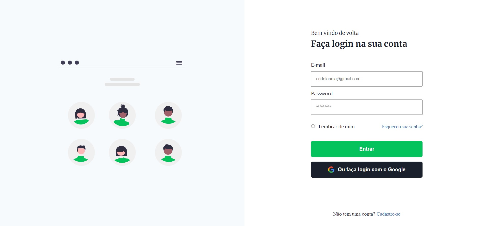

# Presentes de natal 🎁
 

Uma desafio front-end proposto pela comunidade codelândia, criar uma formulário de login simples com html e css.

> 🎯 Desafio #4

[Acesse aqui o site](https://ericodesenvolvedor.github.io/formulario-de-login/)

### Ferramentas utilizadas ⚙️ 

- HTML 
- CSS
- Figma

### Responsivo 📱 

- Layout responsivo.

Criado com :heart: por 
  <a href="https://github.com/Ericodesenvolvedor">ericodesenvolvedor</a>

 
